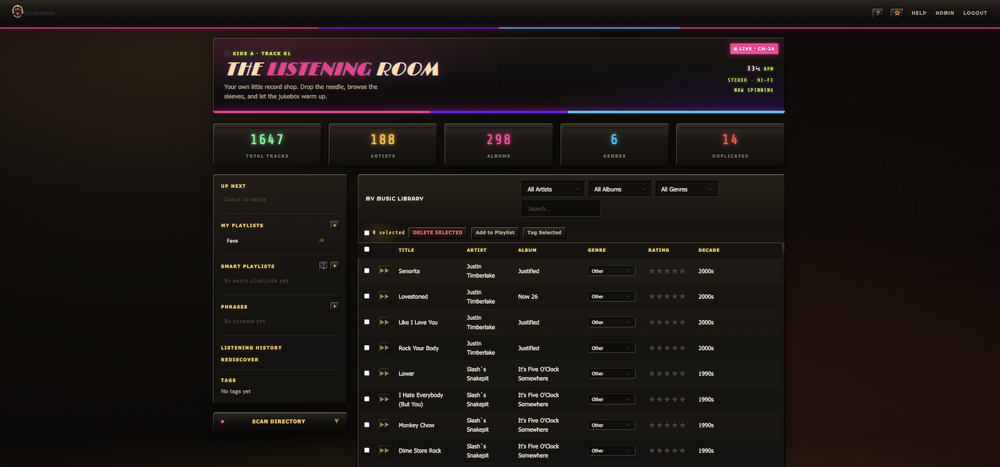
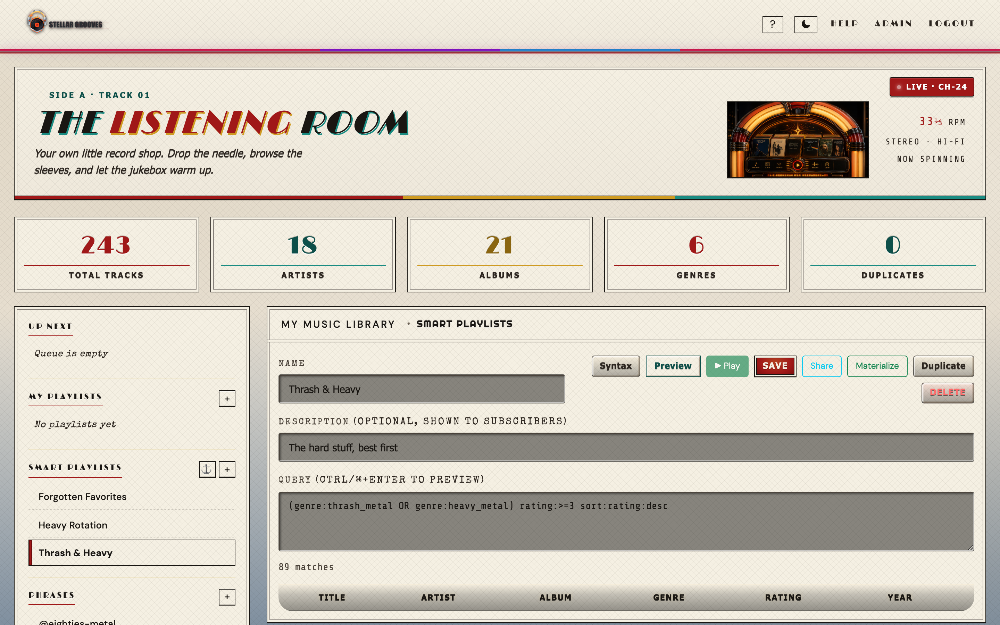
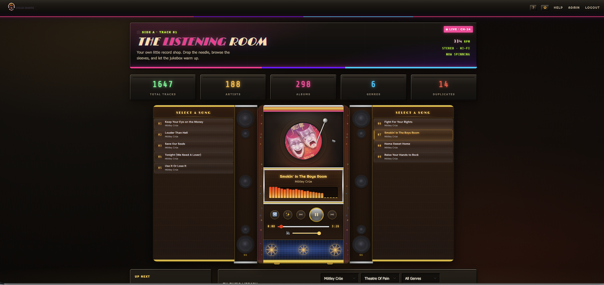
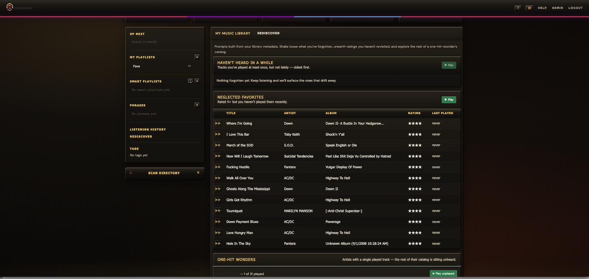
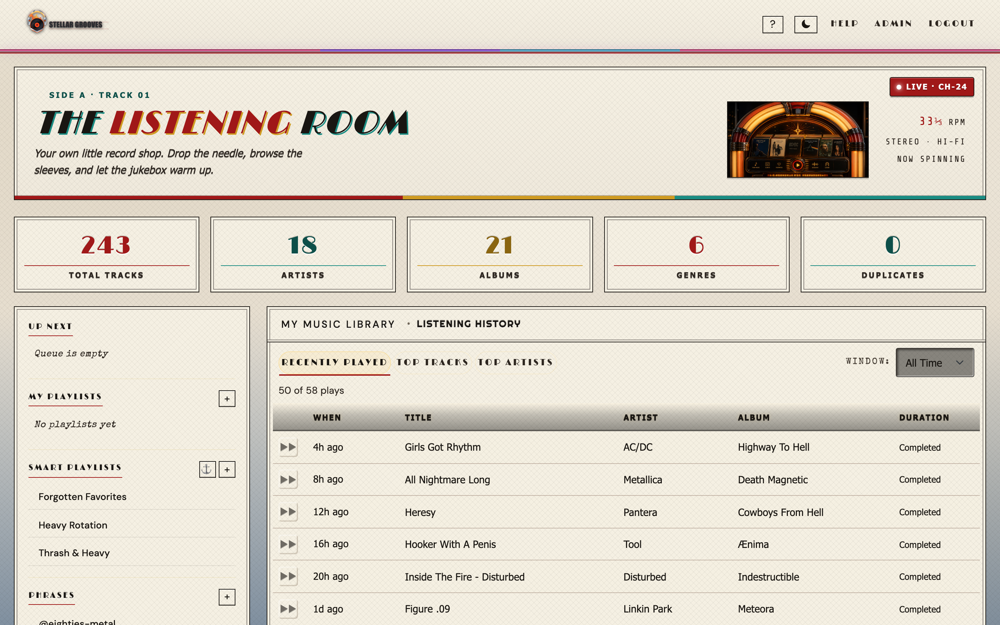
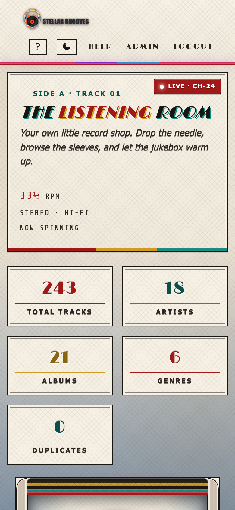
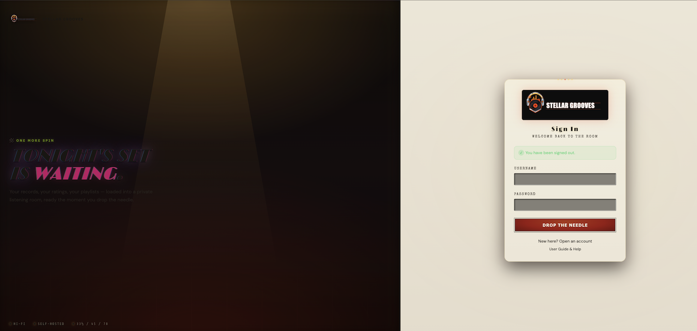

# Stellar Grooves

A self-hosted, multi-user music library for rock and metal collections — built around **smart playlists you can share as queries**. Scan local directories for audio files, auto-categorize tracks by sub-genre, build smart playlists with a focused query DSL (and reusable `@phrase` fragments), publish them so other curators can run your queries against their own libraries, manage regular playlists with drag-drop reordering, rate your favorites, resolve duplicates, and stream everything in the browser with a retro jukebox-themed UI. Installable as a Progressive Web App on desktop and mobile.

Built with Spring Boot, MongoDB, and vanilla JavaScript.



> **A curator's library.** Write a smart playlist, publish the share link, and other curators run your *query* against their *own* libraries — they only ever see tracks they themselves own.

## Documentation

- **[HOW_TO_USE.md](HOW_TO_USE.md)** — end-to-end walkthrough of the everyday browser flow (signup, scanning, smart playlists, sharing).
- **[CONTRIBUTING.md](CONTRIBUTING.md)** — how to set up a dev environment, run tests, and submit PRs.
- **[SECURITY.md](SECURITY.md)** — how to report a vulnerability privately.

---

## Screenshots

<table>
  <tr>
    <td align="center" width="50%">
      <a href="docs/screenshots/smart-playlist-editor.png"></a>
      <br /><sub><b>Smart playlist editor</b> — live match count and preview</sub>
    </td>
    <td align="center" width="50%">
      <a href="docs/screenshots/jukeplayer.png"></a>
      <br /><sub><b>Jukebox player</b> — crossfade, queue, media-session controls</sub>
    </td>
  </tr>
  <tr>
    <td align="center" width="50%">
      <a href="docs/screenshots/rediscover-playlists.png"></a>
      <br /><sub><b>Listening rediscovery</b> — forgotten tracks, neglected favorites, one-hit wonders</sub>
    </td>
    <td align="center" width="50%">
      <a href="docs/screenshots/listening-history.png"></a>
      <br /><sub><b>Listening history</b> — Recently Played · Top Tracks · Top Artists</sub>
    </td>
  </tr>
  <tr>
    <td align="center" width="50%">
      <a href="docs/screenshots/mobile-pwa.png"></a>
      <br /><sub><b>Mobile / PWA</b> — installable on iOS and Android home screens</sub>
    </td>
    <td align="center" width="50%">
      <a href="docs/screenshots/login-screen.png"></a>
      <br /><sub><b>Login</b> — form auth with rate limiting and account lockout</sub>
    </td>
  </tr>
</table>

---

## Features

### Library & Playback
- **Directory scanning** — recursively finds audio files (`.mp3`, `.flac`, `.m4a` by default; configurable via `SCAN_SUPPORTED_EXTENSIONS`) and extracts metadata (artist, album, title, year, cover art) via JAudioTagger; computes SHA-256 file hashes for exact duplicate detection; configurable scan depth limit; symlink-safe; per-file timeout prevents corrupt files from stalling the scan
- **Real-time scan progress** — SSE endpoint streams live progress (files imported, skipped, errors) to the browser during scanning
- **Per-user scan rate limiting** — configurable cooldown between scans (default 60s) to prevent resource exhaustion
- **Auto genre classification** — customizable JSON catalog of 80+ rock/metal artists spanning the 1960s-2020s, mapping to Classic Rock, Hard Rock, Hair Metal, Heavy Metal, and Thrash Metal; user genre corrections are persisted and override the static catalog for future scans
- **Duplicate detection & resolution** — skips files already imported by both file path and metadata (title + artist); paginated duplicates view to compare and delete duplicate tracks; optional file-hash–based duplicate detection to find exact copies regardless of metadata differences
- **In-browser playback** — persistent audio player bar with play/pause, seek, volume, shuffle, and album art display; HTTP Range support for seeking in large files; auto-advances to next track
- **Crossfade & gapless playback** — toggle crossfade (3-second fade between tracks) for seamless listening; uses dual audio elements for smooth transitions
- **Queue management** — add tracks to an "Up Next" queue; queue drains before sequential/shuffle playback resumes; clear queue with one click; queue persists to MongoDB across sessions and devices (falls back to localStorage); track ownership validated on save; real-time sync across tabs/devices via WebSocket (STOMP over SockJS)
- **Media Session integration** — lock screen and notification controls (play/pause/skip/seek) with track metadata and album art on mobile and desktop; syncs playback position for OS-level progress bars
- **Keyboard shortcuts** — Space to play/pause, left/right arrows to seek, up/down for volume (active when player is visible and no input is focused)
- **Audio transcoding** — on-the-fly FLAC/M4A to MP3 conversion via ffmpeg; request `?format=mp3` on the transcode endpoint; gracefully degrades if ffmpeg is not installed
- **Scheduled scans** — configure a cron expression and directory path per user; the system checks every 60 seconds and triggers scans when due

### Smart Playlists & Curation
- **Smart playlists** — saved queries written in a focused DSL (`genre:hard_rock rating:>=4 lastPlayed:>1y sort:random limit:25`). Supported fields: `artist`, `album`, `title` (text contains), `genre`, `year`, `rating`, `playCount` (numeric with `=`/`>`/`>=`/`<`/`<=`/`low..high`), `tag`, and `lastPlayed:<7d` / `lastPlayed:>1mo` time windows. Boolean composition with `AND`/`OR`/parens, `-` for negation, top-level `sort:` (with `random`) and `limit:` clauses
- **Phrases** — name a query fragment once and reuse it everywhere via `@phrase-name`; phrases compose other phrases; cycle detection, max-depth, and max-resolutions guards keep expansion bounded
- **Smart playlist preview & match count** — dry-run any query (saved or unsaved) to see results and a count before committing
- **Materialize** — snapshot a smart playlist's current matches into a regular (static) playlist for export or for sharing audio
- **Smart playlist sharing (query sharing, not audio)** — the curator publishes a public link; subscribers run the *curator's query* against their *own library*. Subscribers only see tracks they themselves own. Subscriber count is visible to the curator
- **Subscribe by link** — paste a `/shared/smart-playlists/{token}` URL to add a curator's playlist to your sidebar
- **Fork** — copy a curator's query into your own editable smart playlist; forks are independent of later curator edits; if the source has been deleted, fork falls back to the last known query body
- **Source-deleted state** — if a curator deletes a shared playlist, subscribers see a "source deleted" badge but the cached query keeps working until they fork or unsubscribe
- **Listening rediscovery** — pre-built queries surface tracks you've forgotten about: high-rated-not-played-recently, high-rated-low-play-count, and one-track-only artists

### Organization & Search
- **Full-text search** — MongoDB text index across title (3x weight), artist (2x), and album (1x) with relevance scoring; falls back to regex search when text index is unavailable
- **Playlist management** — create playlists, add/remove tracks, drag-drop reorder tracks, sort by title/artist/album/genre/rating/year, export as M3U or JSON; share playlists via read-only links
- **Custom tags** — apply free-form tags to tracks (e.g. `live`, `acoustic`, `road-trip`) with bulk add/remove across up to 1000 files; tag listing with usage counts; tags are searchable in smart-playlist queries via `tag:value`
- **Library export** — download full library metadata as JSON or CSV for backup
- **Backup & restore** — full library backup (tracks, playlists, ratings, genre corrections, file hashes) as a single portable JSON file; restore on any instance to recreate your library metadata and playlists
- **Library statistics** — genre distribution, top 10 artists, decade distribution, and average rating via MongoDB aggregation
- **Soft delete / trash** — deleted tracks go to a 30-day trash instead of being permanently removed; restore or permanently delete from trash; paginated trash listing
- **Advanced filtering** — simultaneous artist, album, and genre dropdown filters alongside full-text search; all filters combine with AND logic
- **Browse views** — drill-down by artist, album, and genre; album grid view with cover art thumbnails (toggleable to list view); sortable columns including rating and decade
- **Bulk operations** — checkbox selection with select-all toggle; bulk delete and bulk add-to-playlist
- **User ratings** — 5-star rating widget on each track; sortable by rating
- **Inline genre editing** — reclassify any track tagged as "Other" directly from the library table
- **Play history tracking** — every track that reaches 50% of its duration (or plays to completion) is recorded as a `PlayEvent`; per-track play counts and last-played timestamps are denormalized onto each track; seeks are excluded from listened-time via a wall-clock vs playback-position check
- **Listening History view** — dedicated sidebar entry surfacing Recently Played, Top Tracks, and Top Artists; each tab supports a time window (All Time / 7 Days / 30 Days / Last Year); Top Artists rows drill into the artist's albums; aggregations backed by `$group` over `PlayEvent`
- **Virtual scrolling** — DOM virtualization kicks in at 250+ tracks; only visible rows are rendered, supporting libraries with 10,000+ tracks

### Administration & Security
- **Multi-user** — per-user libraries with session-based (form login) and JWT authentication; 15-minute access tokens with 7-day refresh tokens; 30-minute idle session timeout (configurable via `SESSION_TIMEOUT`)
- **Email verification** — optional email verification on signup (enable with `EMAIL_VERIFICATION_REQUIRED=true`); 24-hour verification tokens; resend verification endpoint; login blocked until verified; anti-enumeration responses
- **Password reset** — token-based password reset flow with 15-minute one-time-use tokens; tokens are SHA-256 hashed before storage (raw token never persisted); anti-enumeration response (always returns 200)
- **Account lockout** — accounts lock after 5 consecutive failed login attempts; auto-unlocks after 15 minutes; configurable thresholds; all refresh tokens are revoked on lockout
- **Admin dashboard** — stats overview (users, files, playlists), paginated user management table with per-user file counts, delete user with cascade
- **Distributed rate limiting** — pluggable `RateLimitStore` interface with in-memory (default) and Redis-backed implementations; auto-detects Redis on the classpath for multi-instance deployments
- **Cover art storage quotas** — configurable per-user cover art quota (default 500 MB); quota checked during scan, extraction skipped when exceeded
- **Request body size limits** — Tomcat max post size, max header size, and multipart limits configured to prevent oversized payloads
- **Optimistic locking** — playlists use `@Version`-based optimistic locking to prevent lost updates from concurrent modifications; conflicts return 409 with a retry prompt
- **Per-user scan locking** — only one scan can run per user at a time; concurrent scan attempts are rejected, preventing cover art quota race conditions
- **Security** — CSRF protection (HttpOnly cookies with meta-tag delivery), rate limiting on auth and scan endpoints (with proxy-aware IP detection, trusted proxy validation, and `Retry-After` header), stricter IP-based rate limiting on login/signup endpoints (separate bucket, default 5 req/min), configurable CORS origins (explicit origins, not patterns), path traversal prevention on scan and stream endpoints, symlink detection, server-side input validation with typed DTOs and `@Size`/`@Pattern` constraints on search and scan parameters, Content Security Policy headers (no `unsafe-inline` for scripts), Permissions-Policy header (disables geolocation, microphone, camera, payment, USB), password complexity requirements (enforced on both signup and password reset), case-insensitive username normalization (prevents `User`/`user` duplicates), JWT with `jti`/`iss` claims and full role propagation on token refresh, token blacklisting on both logout and refresh, regex search query timeout (5s) and length limit (200 chars)
- **RFC 7807 error responses** — all API error responses follow the Problem Details standard (`type`, `title`, `status`, `detail`) with backwards-compatible `error` property
- **Audit logging** — dedicated `AUDIT` logger routed to a separate `logs/audit.log` file with 90-day retention; structured MDC context tracks all security-sensitive operations: logins, signups, password resets, file deletions, genre changes, playlist modifications, and admin actions
- **API documentation** — interactive Swagger UI at `/swagger-ui.html` with OpenAPI 3.0 spec at `/api-docs`; JWT bearer auth support; disabled in production profile
- **API versioning** — all REST endpoints under `/api/v1/` for forward compatibility
- **Structured logging** — correlation IDs on every request (`X-Correlation-Id` header), MDC-based log pattern for request tracing; optional JSON log output for production via Logstash encoder (activate with `json-logging` profile); client-side correlation IDs automatically sent in fetch headers for end-to-end tracing
- **Prometheus metrics** — `/actuator/prometheus` endpoint exposes application metrics (request counts, latencies, JVM stats) for Prometheus scraping; `/actuator/metrics` for JSON metric queries
- **Health check** — `/actuator/health` endpoint for monitoring; health details (including MongoDB connectivity) are only visible to authenticated users (`show-details=when-authorized`)

### UI & Accessibility
- **Progressive Web App (PWA)** — installable on desktop and mobile via "Add to Home Screen"; service worker caches static assets for instant loading with build-version-aware cache invalidation; offline fallback page when the network is unavailable; web app manifest with themed icons; cache-busted CSS/JS includes via version query parameters
- **Jukebox theme** — retro dark UI with neon glow effects, chrome accents, wood grain textures, and "Righteous" display typography
- **Light mode** — full light theme with manual toggle (sun/moon button in navbar); respects `prefers-color-scheme` media query; preference saved to localStorage
- **Loading states** — spinner feedback on genre changes, rating updates, bulk delete, add-to-playlist, and search operations
- **Toast notifications** — non-intrusive error and success toasts for all async operations (genre changes, rating updates, deletions, playlist actions, search failures)
- **Album art** — embedded cover art extracted during scan, displayed in the player bar, album grid view, and available via API
- **Accessibility** — ARIA labels on all interactive elements, `aria-sort` on sortable columns, `aria-pressed` on toggle buttons, `aria-live` regions for status updates and toast notifications, `aria-hidden` on decorative elements (equalizer canvas), `role="group"` on star rating widget, `role="button"` with keyboard handlers on drill-down rows and jukebox side items, modal focus management (auto-focus first element on open), `:focus-visible` outlines for keyboard navigation, keyboard-navigable sort headers, `prefers-reduced-motion` support
- **Performance monitoring** — Web Vitals reporting (LCP, FID, CLS) via PerformanceObserver API; virtual scrolling for libraries with 250+ tracks
- **Responsive design** — mobile-first layout with Bootstrap 5.3; columns hide on small screens; track action buttons visible on touch devices (no hover required)

---

## Prerequisites

| Requirement | Version | Notes |
|-------------|---------|-------|
| Java JDK | 17+ | [Adoptium Temurin](https://adoptium.net) recommended |
| Apache Maven | 3.6+ | Or use `mvn` if installed globally |
| MongoDB | 6.0+ | Must be running before the app starts |
| ffmpeg | 5.0+ | *Optional* — required only for audio transcoding (`/transcode` endpoint) |

### Installing MongoDB

**macOS (Homebrew)**
```bash
brew tap mongodb/brew
brew install mongodb-community
brew services start mongodb-community
```

**Ubuntu / Debian**
```bash
sudo apt-get install -y mongodb
sudo systemctl start mongodb
```

**Windows**

Download the MSI installer from [mongodb.com/try/download/community](https://www.mongodb.com/try/download/community), then start the service:
```powershell
net start MongoDB
```

No additional database setup is needed — MongoDB creates the database and collections automatically on first run.

---

## Quick Start

A `JWT_SECRET` environment variable is **required** to start the app. Generate one with:

```bash
export JWT_SECRET=$(openssl rand -base64 64)
```

Then run:

```bash
git clone <repo-url>
cd stellar-grooves

# Run with Maven (development)
JWT_SECRET=$JWT_SECRET mvn spring-boot:run -Dspring-boot.run.profiles=dev
```

Windows:
```powershell
$env:JWT_SECRET = [Convert]::ToBase64String((1..64 | ForEach-Object { Get-Random -Max 256 }) -as [byte[]])
mvn spring-boot:run "-Dspring-boot.run.profiles=dev"
```

The app starts at **http://localhost:8080**.

### Docker

The fastest way to get started — requires only Docker:

```bash
JWT_SECRET=$(openssl rand -base64 64) docker compose up --build
```

`JWT_SECRET` is **required** — Docker Compose will fail immediately if it is not set. This starts the app and MongoDB together with hardened container security (`no-new-privileges`, dropped capabilities, read-only root filesystem). Set `MUSIC_DIR` to mount your music library:

```bash
JWT_SECRET=$JWT_SECRET MUSIC_DIR=/path/to/your/music docker compose up --build
```

To enable Redis-backed distributed rate limiting, uncomment the `redis` service in `docker-compose.yml`.

### Build a JAR (production)

```bash
mvn clean package -DskipTests
JWT_SECRET=$JWT_SECRET java -jar target/stellar-grooves-0.0.1-SNAPSHOT.jar --spring.profiles.active=prod
```

### Run tests

```bash
# Backend (Java)
mvn test                    # Unit tests only
mvn verify                  # Unit tests + JaCoCo coverage check + OWASP dependency check
mvn test -Dtest='*IT'       # Integration tests only (requires Docker for Testcontainers)

# Frontend (JavaScript)
npm test                    # Vitest unit tests (helpers, filtering, crossfade, virtual scroll)
npm run test:watch          # Vitest in watch mode
```

Backend tests generate a JaCoCo coverage report at `target/site/jacoco/index.html`.

### Check code formatting

```bash
mvn spotless:check      # verify formatting
mvn spotless:apply      # auto-fix formatting
```

---

## Configuration

All settings live in `src/main/resources/application.properties` and can be overridden via environment variables.

### Core Settings

| Property | Env var | Default | Description |
|----------|---------|---------|-------------|
| `spring.data.mongodb.uri` | `MONGO_URI` | `mongodb://localhost:27017/stellar_grooves` | MongoDB connection string |
| `stellar.grooves.jwtSecret` | `JWT_SECRET` | *(none — required)* | Base64-encoded JWT signing secret (minimum 256 bits). App **fails to start** without this. |
| `stellar.grooves.jwtExpirationMs` | `JWT_EXPIRATION_MS` | `900000` (15 min) | Access token lifetime in milliseconds |
| `stellar.grooves.refreshTokenExpirationMs` | `REFRESH_TOKEN_EXPIRATION_MS` | `604800000` (7 days) | Refresh token lifetime in milliseconds |
| `stellar.grooves.swagger.enabled` | — | `false` | Enable/disable Swagger UI and OpenAPI endpoints (enable explicitly in dev) |
| `server.port` | `PORT` | `8080` | HTTP listen port |

### Security & Rate Limiting

| Property | Env var | Default | Description |
|----------|---------|---------|-------------|
| `stellar.grooves.cors.allowedOrigins` | `CORS_ALLOWED_ORIGINS` | `http://localhost:8080,http://127.0.0.1:8080` | Comma-separated CORS origin patterns |
| `stellar.grooves.login.maxFailedAttempts` | `LOGIN_MAX_FAILED_ATTEMPTS` | `5` | Failed login attempts before account lockout |
| `stellar.grooves.login.lockoutDurationMinutes` | `LOGIN_LOCKOUT_MINUTES` | `15` | Minutes before a locked account auto-unlocks |
| `stellar.grooves.rateLimit.maxRequests` | — | `10` | Max general auth requests per IP per window |
| `stellar.grooves.rateLimit.windowMs` | — | `60000` (1 min) | General auth rate limit window in milliseconds |
| `stellar.grooves.rateLimit.login.maxRequests` | — | `5` | Max login/signup requests per IP per window |
| `stellar.grooves.rateLimit.login.windowMs` | — | `60000` (1 min) | Login/signup rate limit window in milliseconds |
| `stellar.grooves.rateLimit.trustProxy` | `RATE_LIMIT_TRUST_PROXY` | `false` | Trust `X-Forwarded-For` header for client IP detection |
| `stellar.grooves.rateLimit.trustedProxies` | `RATE_LIMIT_TRUSTED_PROXIES` | *(empty)* | Comma-separated proxy IPs allowed to set `X-Forwarded-For` (required when `trustProxy=true`; empty list disables proxy trust even if `trustProxy=true`) |
| `stellar.grooves.rateLimit.shared.maxRequests` | `RATE_LIMIT_SHARED_MAX` | `5` | Max requests per IP per window for public `/api/v1/shared/**` endpoints |
| `stellar.grooves.rateLimit.shared.windowMs` | `RATE_LIMIT_SHARED_WINDOW_MS` | `60000` (1 min) | Window for the shared-endpoint rate limit |
| `stellar.grooves.userRateLimit.maxRequests` | `USER_RATE_LIMIT_MAX` | `10` | Max per-user requests per window for cooldown-protected endpoints (e.g. materialize) |
| `stellar.grooves.userRateLimit.windowSeconds` | `USER_RATE_LIMIT_WINDOW_SECONDS` | `60` | Window for the per-user rate limit |
| `stellar.grooves.adminRateLimit.maxRequests` | `ADMIN_RATE_LIMIT_MAX` | `20` | Max requests per admin per window for admin operations |
| `stellar.grooves.adminRateLimit.windowSeconds` | `ADMIN_RATE_LIMIT_WINDOW_SECONDS` | `60` | Window for the admin rate limit |
| `server.servlet.session.timeout` | `SESSION_TIMEOUT` | `30m` | Idle session timeout |

### Scanner & Storage

| Property | Env var | Default | Description |
|----------|---------|---------|-------------|
| `stellar.grooves.scan.maxDepth` | — | `20` | Max directory depth for recursive scan |
| `stellar.grooves.scan.hardMaxDepth` | `SCAN_HARD_MAX_DEPTH` | `50` | Absolute upper bound on scan depth, even if `maxDepth` is overridden |
| `stellar.grooves.scan.timeoutMinutes` | `SCAN_TIMEOUT_MINUTES` | `5` | Overall scan timeout |
| `stellar.grooves.scan.cooldownSeconds` | `SCAN_COOLDOWN_SECONDS` | `60` | Per-user cooldown between scans |
| `stellar.grooves.scan.perFileTimeoutSeconds` | `SCAN_PER_FILE_TIMEOUT_SECONDS` | `30` | Timeout for reading a single audio file |
| `stellar.grooves.scan.fileReaderThreads` | `SCAN_FILE_READER_THREADS` | `2` | Thread pool size for audio file reading during scans |
| `stellar.grooves.scan.batchSize` | `SCAN_BATCH_SIZE` | `200` | Tracks committed per Mongo batch insert |
| `stellar.grooves.scan.supportedExtensions` | `SCAN_SUPPORTED_EXTENSIONS` | `.mp3,.m4a,.flac` | Comma-separated list of audio file extensions to scan (add `.ogg`, `.wav`, `.opus`, etc.) |
| `stellar.grooves.scan.allowedBaseDirs` | `SCAN_ALLOWED_BASE_DIRS` | *(empty — any path)* | Comma-separated allow-list of base directories. When set, scans must be inside one of these. Recommended for shared/multi-tenant deployments |
| `stellar.grooves.coverArt.maxBytesPerUser` | `COVER_ART_QUOTA_BYTES` | `524288000` (500 MB) | Per-user cover art storage quota |
| `stellar.grooves.coverArt.maxBytesPerImage` | `COVER_ART_MAX_BYTES_PER_IMAGE` | `10485760` (10 MB) | Max bytes per individual cover art image |
| `stellar.grooves.coverArt.maxBytesGlobal` | `COVER_ART_GLOBAL_QUOTA_BYTES` | `10737418240` (10 GB) | Global cap across all users |
| `stellar.grooves.trash.retentionDays` | `TRASH_RETENTION_DAYS` | `30` | Days a soft-deleted track stays in trash before purge |
| `stellar.grooves.trash.purgeCron` | `TRASH_PURGE_CRON` | `0 0 3 * * *` | Cron for the trash-purge job (default 3 AM daily) |
| `stellar.grooves.catalogPath` | — | *(bundled catalog.json)* | Path to a custom artist-genre catalog JSON file |

### Smart Playlists

| Property | Env var | Default | Description |
|----------|---------|---------|-------------|
| `stellar.grooves.smartPlaylist.queryTimeoutSeconds` | `SMART_PLAYLIST_QUERY_TIMEOUT_SECONDS` | `10` | Max time to evaluate a single smart-playlist query against MongoDB |
| `stellar.grooves.smartPlaylist.materializeMax` | `SMART_PLAYLIST_MATERIALIZE_MAX` | `5000` | Cap on tracks captured when snapshotting a smart playlist into a regular playlist |

### Search, Export, Queue, Transcoding

| Property | Env var | Default | Description |
|----------|---------|---------|-------------|
| `stellar.grooves.search.maxQueryLength` | `SEARCH_MAX_QUERY_LENGTH` | `200` | Max length of a search query string |
| `stellar.grooves.export.maxSize` | `EXPORT_MAX_SIZE` | `50000` | Max tracks included in a library export |
| `stellar.grooves.queue.maxTracks` | `QUEUE_MAX_TRACKS` | `5000` | Max tracks in a saved playback queue |
| `stellar.grooves.transcode.maxFileSize` | `TRANSCODE_MAX_FILE_SIZE` | `524288000` (500 MB) | Max source-file size accepted by the transcode endpoint |
| `stellar.grooves.transcode.timeoutSeconds` | `TRANSCODE_TIMEOUT_SECONDS` | `300` | Max ffmpeg invocation time |

### Request Size Limits

| Property | Default | Description |
|----------|---------|-------------|
| `server.tomcat.max-http-form-post-size` | `2MB` | Maximum form POST size |
| `server.max-http-request-header-size` | `16KB` | Maximum request header size |
| `spring.servlet.multipart.max-file-size` | `2MB` | Maximum multipart file size |
| `spring.servlet.multipart.max-request-size` | `2MB` | Maximum multipart request size |

### Email Verification

| Property | Env var | Default | Description |
|----------|---------|---------|-------------|
| `stellar.grooves.email.verificationRequired` | `EMAIL_VERIFICATION_REQUIRED` | `false` | Require email verification before login |
| `stellar.grooves.mail.enabled` | `MAIL_ENABLED` | `false` | Enable sending emails (verification + password reset) |
| `stellar.grooves.mail.from` | `MAIL_FROM` | `noreply@stellargrooves.local` | Sender address for emails |
| `stellar.grooves.baseUrl` | `BASE_URL` | `http://localhost:8080` | Base URL used in email links |

When `EMAIL_VERIFICATION_REQUIRED=true`, new users receive a verification email with a 24-hour link. Login is blocked until the email is verified. When disabled (default), accounts are automatically verified on creation for backward compatibility.

> **Note:** Email verification requires `MAIL_ENABLED=true` and valid SMTP settings. When mail is disabled, verification tokens are logged at INFO level for development use.

### Spring Profiles

| Profile | Activate with | Description |
|---------|--------------|-------------|
| `dev` | `--spring.profiles.active=dev` | Debug logging, Thymeleaf cache disabled, CORS allows `localhost:8080`, Swagger enabled |
| `prod` | `--spring.profiles.active=prod` | INFO logging, requires `CORS_ALLOWED_ORIGINS` env var, trusts proxy headers from configured IPs, Swagger disabled, audit + app logs written to files |
| `json-logging` | `--spring.profiles.active=prod,json-logging` | Structured JSON console output via Logstash encoder; use with `prod` for centralized log aggregation (ELK, Grafana Loki) |
| `file-logging` | `--spring.profiles.active=dev,file-logging` | Force rolling file appenders for app + audit logs even outside `prod` (useful in dev when you need persistent logs without enabling the full prod profile) |

When no profile is active, the base `application.properties` defaults apply.

**Example — production deployment:**
```bash
MONGO_URI=mongodb://mongo-host:27017/grooves \
JWT_SECRET=$(openssl rand -base64 64) \
PORT=9090 \
CORS_ALLOWED_ORIGINS=https://myapp.example.com \
RATE_LIMIT_TRUST_PROXY=true \
RATE_LIMIT_TRUSTED_PROXIES=127.0.0.1,::1 \
ADMIN_PASSWORD=changeme \
java -jar target/stellar-grooves-0.0.1-SNAPSHOT.jar --spring.profiles.active=prod
```

**Example — production with structured JSON logs (for ELK/Loki):**
```bash
java -jar target/stellar-grooves-0.0.1-SNAPSHOT.jar --spring.profiles.active=prod,json-logging
```

> **Security note:** `JWT_SECRET` is required. Generate a strong Base64-encoded key (minimum 32 bytes decoded) with `openssl rand -base64 64`.

### Admin User

On first startup, you can create an admin user via environment variables:

```bash
ADMIN_PASSWORD=changeme java -jar target/stellar-grooves-0.0.1-SNAPSHOT.jar
```

| Env var | Default | Description |
|---------|---------|-------------|
| `ADMIN_PASSWORD` | *(none — required)* | Password for the initial admin user |
| `ADMIN_USERNAME` | `admin` | Username for the admin user |
| `ADMIN_EMAIL` | `admin@stellargrooves.local` | Email for the admin user |

The admin is only created if no admin user already exists. If a user with the given username exists but lacks the admin role, they are promoted.

### Redis (Optional — Distributed Rate Limiting)

When `spring-boot-starter-data-redis` is on the classpath and a Redis instance is available, rate limiting automatically switches from in-memory to Redis-backed. This enables consistent rate limiting across multiple app instances.

```bash
# application.properties or env vars
spring.data.redis.host=localhost
spring.data.redis.port=6379
```

With Docker Compose, uncomment the `redis` service block.

### Custom Artist Catalog

The artist-genre mapping is stored in `src/main/resources/catalog.json`. To customize without recompiling, create your own JSON file and point to it:

```bash
stellar.grooves.catalogPath=/path/to/my-catalog.json \
java -jar target/stellar-grooves-0.0.1-SNAPSHOT.jar
```

The JSON format maps artist names to arrays of genre values:
```json
{
  "Artist Name": ["CLASSIC_ROCK", "HARD_ROCK"],
  "Another Band": ["THRASH_METAL"]
}
```

**Genre corrections:** When a user changes a track's genre in the UI, that correction is stored in MongoDB and takes precedence over the static catalog for future scans. This means the catalog effectively "learns" from user corrections without editing the JSON file.

---

## First Use

1. Open **http://localhost:8080/signup** and create an account.
2. Log in at **http://localhost:8080/login**.
3. Enter the absolute path to a music directory (e.g. `/home/user/Music`) and click **Start Scan**.
4. Watch real-time progress as files are scanned, imported, and categorized.
5. Tracks appear in the library with extracted metadata, genre classification, and album art.
6. Click the play button on any row to start streaming. Use keyboard shortcuts (Space, arrows) to control playback.
7. Toggle crossfade with the sparkle button for smooth transitions between tracks.
8. Use the artist, album, and genre filter dropdowns or the search box to find tracks.
9. Rate tracks with the 5-star widget. Sort by any column including rating.
10. Create playlists from the sidebar, add tracks via the "+" button, and reorder with drag-drop.
11. Create a **Smart Playlist** with a query like `genre:hard_rock rating:>=4 sort:rating:desc limit:50` — see [HOW_TO_USE.md](HOW_TO_USE.md) for the full DSL.
12. Define reusable `@phrase` fragments and reference them from any smart playlist (`@road-trip rating:>=4`).
13. Share a smart playlist — subscribers run *your* query against *their* library; or fork it into their own editable copy.
14. Share a regular playlist via the share button — generates a read-only public link.
15. Select multiple tracks with checkboxes for bulk delete or bulk add-to-playlist.
16. Deleted tracks go to trash — restore them or empty trash to permanently remove.
17. Click the "Duplicated Songs" stat card to review and resolve duplicate tracks (paginated).
18. Export playlists as M3U or JSON, or export your entire library as JSON/CSV from the library view.
19. Use the hash-based duplicates view to find exact file copies across different folders.
20. Back up your entire library (tracks + playlists + ratings + smart playlists + phrases) via the backup endpoint — restore it on any instance.
21. Set up a scheduled scan to auto-import new files on a cron schedule.
22. Open the **Listening History** sidebar entry for Recently Played, Top Tracks, and Top Artists across configurable time windows.
23. Open **Rediscover** to surface forgotten tracks, neglected favorites, and one-hit-wonder artists from your library.
24. Apply custom **Tags** (e.g. `live`, `acoustic`) and use them in smart-playlist queries with `tag:live`.
25. Toggle light/dark mode with the sun/moon button in the navbar.
26. Admin users can access the admin dashboard at **/admin** to manage users.
27. Install the app as a PWA from the browser's install prompt for a standalone experience.
28. Visit **/help** for the built-in user guide — accessible from the navbar, login, and signup pages (no login required).
29. Browse the interactive API documentation at **/swagger-ui.html** (dev mode only).

---

## Monitoring

A health endpoint is available at `/actuator/health` (no authentication required). It reports basic application status. Detailed health information (including MongoDB connectivity) is only shown to authenticated users (`show-details=when-authorized`).

```bash
curl http://localhost:8080/actuator/health
# {"status":"UP"}
```

Prometheus metrics are exposed at `/actuator/prometheus` for scraping, and JSON metrics at `/actuator/metrics`.

---

## Operations & Hardening

A short checklist for self-hosters running Stellar Grooves on a public network.

**Required before exposing the app to the internet:**

- **Run with the `prod` profile**: `--spring.profiles.active=prod` (or `SPRING_PROFILES_ACTIVE=prod`). This disables Swagger/OpenAPI, tightens logging, and trusts proxy headers from the configured trusted-proxy list.
- **Set `JWT_SECRET`** to a Base64-encoded value of at least 256 bits. The app refuses to start in `prod` without it. Generate one with `openssl rand -base64 32`.
- **Set `CORS_ALLOWED_ORIGINS`** to the exact origins that should be allowed (comma-separated). The app refuses to start in `prod` if this is empty.
- **Set `MONGO_URI`** to a MongoDB instance with authentication enabled. Don't expose MongoDB to the public internet.
- **Set `ADMIN_PASSWORD`** on first startup so the bootstrap admin user has a strong password (the bootstrap process logs whether it created a new admin or promoted an existing user).
- **Set `SCAN_ALLOWED_BASE_DIRS`** (comma-separated) to restrict where the scanner can read from — paths outside the allowlist are rejected. Recommended even on single-tenant deployments.

**Reverse proxy and TLS:**

- Terminate TLS at a reverse proxy (Caddy, nginx, Traefik). HSTS is already enabled by the application security config; the proxy should also send HSTS headers and redirect HTTP → HTTPS.
- **Restrict `/actuator/*`** at the proxy. The app exposes `/actuator/health` (anonymous, basic status only) and `/actuator/prometheus` + `/actuator/metrics`. Restrict the latter two to trusted IPs (your scrape target) or strip them from public traffic.
- Configure `RATE_LIMIT_TRUSTED_PROXIES` to your reverse-proxy IPs so the rate limiter sees real client IPs from `X-Forwarded-For` instead of the proxy's IP.

**Container and process:**

- The provided `Dockerfile` already runs as a non-root user. If you build your own image, preserve that.
- Mount music libraries **read-only** (`:ro`) into the container; the scanner doesn't need write access.
- Persist MongoDB data on a backed-up volume. The library catalog can be rescanned, but user accounts, playlists, listening history, and smart-playlist definitions cannot.

**Updates:**

- Watch GitHub releases for security patches. Dependabot is enabled in this repo for Maven, npm, and GitHub Actions ecosystems.

---

## REST API

> **Interactive docs:** Browse the full API at [/swagger-ui.html](http://localhost:8080/swagger-ui.html) when the app is running. The OpenAPI spec is available at `/api-docs`.

All endpoints under `/api/v1/library/*`, `/api/v1/playlists/*`, and `/api/v1/admin/*` require authentication. Use the session cookie from form login, or pass a JWT via the `Authorization: Bearer <token>` header (obtained from `/api/v1/auth/signin`).

Session-authenticated requests (form login) must include the CSRF token header for any mutating request (POST, PUT, PATCH, DELETE). The token is available from `<meta name="_csrf">` tags in Thymeleaf pages, or from the HttpOnly `XSRF-TOKEN` cookie for non-browser clients.

Login/signup endpoints are rate-limited to 5 requests per minute per IP. Other auth endpoints are limited to 10 per minute. Scan endpoints have a per-user cooldown (default 60s). Rate-limited responses include a `Retry-After` header.

All error responses follow [RFC 7807 Problem Details](https://www.rfc-editor.org/rfc/rfc7807) format with `type`, `title`, `status`, `detail`, and an `error` property for backwards compatibility.

### Auth

| Method | Endpoint | Body | Description |
|--------|----------|------|-------------|
| `POST` | `/api/v1/auth/signup` | `{ "username", "email", "password" }` | Register a new user (password: min 8 chars, requires upper + lower + digit) |
| `POST` | `/api/v1/auth/signin` | `{ "username", "password" }` | Log in; returns `{ token, refreshToken, username }`; returns 401 for invalid credentials or locked accounts (uniform response to prevent enumeration) |
| `POST` | `/api/v1/auth/refresh` | `{ "refreshToken": "..." }` | Exchange a valid refresh token for a new access token + refresh token; blacklists the old JWT |
| `POST` | `/api/v1/auth/logout` | — | Blacklist the current JWT and delete refresh tokens (requires `Authorization: Bearer` header) |
| `POST` | `/api/v1/auth/password-reset/request` | `{ "email": "..." }` | Request a password reset token (always returns 200 to prevent enumeration; token logged at INFO) |
| `POST` | `/api/v1/auth/password-reset/execute` | `{ "token": "...", "newPassword": "..." }` | Reset password using a valid one-time token (15-min expiry); same complexity requirements as signup |
| `GET` | `/api/v1/auth/verify-email?token=...` | — | Verify email address using a 24-hour token (sent on signup when verification is enabled) |
| `POST` | `/api/v1/auth/resend-verification` | `{ "email": "..." }` | Resend verification email (always returns 200 to prevent enumeration) |

### Library

| Method | Endpoint | Body | Description |
|--------|----------|------|-------------|
| `GET` | `/api/v1/library/files` | — | List tracks (paginated); `?page=0&size=50`; optional `?genre=HARD_ROCK`; max 200/page |
| `GET` | `/api/v1/library/search` | — | Search tracks; `?q=metallica&page=0&size=50`; uses text index with relevance scoring, falls back to regex |
| `POST` | `/api/v1/library/scan` | `{ "path": "/absolute/path" }` | Queue an async scan. Returns 202 with `{ jobId, status, queuedAt }`; 409 if a scan is already active; rate-limited per user |
| `GET` | `/api/v1/library/scan/status` | — | Latest `ScanJob` for the user (active if any, else most recent) with live counts, status, current file |
| `GET` | `/api/v1/library/scan/progress` | — | SSE stream of scan events (`snapshot` on connect if active, then `progress`, `complete`, `error`) |
| `GET` | `/api/v1/library/files/{id}/stream` | — | Stream audio (supports HTTP Range) |
| `GET` | `/api/v1/library/files/{id}/transcode?format=mp3` | — | Stream audio transcoded to MP3 via ffmpeg (returns 503 if ffmpeg not installed) |
| `GET` | `/api/v1/library/files/{id}/cover` | — | Get album cover art (30-day cache) |
| `PATCH` | `/api/v1/library/files/{id}/genre` | `{ "genre": "CLASSIC_ROCK" }` | Update a track's genre; records a correction for the artist so future scans use this genre |
| `PATCH` | `/api/v1/library/files/{id}/rating` | `{ "rating": 4 }` | Set track rating (0-5, 0 = unrated) |
| `PUT` | `/api/v1/library/files/{id}/tags` | `{ "tags": ["live", "acoustic"] }` | Replace a track's custom tags (normalized, ≤20 per track, ≤50 chars each) |
| `POST` | `/api/v1/library/files/tags/bulk` | `{ "fileIds": [...], "add": [...], "remove": [...] }` | Bulk add/remove tags across up to 1000 files; rejects the batch if any file would exceed the per-track cap |
| `GET` | `/api/v1/library/tags` | — | List distinct tags with per-tag usage counts: `[{ tag, count }]` |
| `POST` | `/api/v1/library/files/{id}/plays` | `{ "listenedMs": 120000, "completed": true }` | Record a play event (fired automatically by the web player at 50% listened or on track end); atomically increments `playCount` and sets `lastPlayedAt` |
| `GET` | `/api/v1/library/history/recent` | — | Reverse-chronological play events with hydrated track; `?window={all,week,month,year}&page=&size=` |
| `GET` | `/api/v1/library/history/top-tracks` | — | Top tracks by play-count within window; `?window=&limit=` (default 25, max 200) |
| `GET` | `/api/v1/library/history/top-artists` | — | Top artists by play-count within window; `?window=&limit=` |
| `POST` | `/api/v1/library/files/bulk-delete` | `{ "fileIds": ["id1", "id2"] }` | Soft-delete tracks (max 100); moves to trash |
| `GET` | `/api/v1/library/duplicates` | — | Get duplicate track groups by title+artist (paginated); `?page=0&size=50` |
| `GET` | `/api/v1/library/duplicates/by-hash` | — | Get duplicate track groups by file hash (paginated); `?page=0&size=50` |
| `DELETE` | `/api/v1/library/files/{id}` | — | Soft-delete a single track (moves to trash) |
| `DELETE` | `/api/v1/library/files` | — | Clear the current user's entire library |
| `GET` | `/api/v1/library/trash` | — | List tracks in trash (paginated); `?page=0&size=50` |
| `POST` | `/api/v1/library/trash/{id}/restore` | — | Restore a trashed track |
| `DELETE` | `/api/v1/library/trash/{id}` | — | Permanently delete a trashed track |
| `DELETE` | `/api/v1/library/trash` | — | Empty trash (permanently delete all trashed tracks) |
| `GET` | `/api/v1/library/stats` | — | Library statistics: genre/artist/decade distribution, average rating |
| `GET` | `/api/v1/library/export?format=json` | — | Export full library metadata as JSON (attachment download) |
| `GET` | `/api/v1/library/export?format=csv` | — | Export full library metadata as CSV (attachment download) |
| `GET` | `/api/v1/library/backup` | — | Full library backup as JSON (tracks + playlists + ratings + file hashes) |
| `POST` | `/api/v1/library/restore` | `LibraryBackup JSON` | Restore library from a backup; skips existing tracks by file path; recreates playlists |
| `GET` | `/api/v1/library/queue` | — | Get the user's persisted playback queue |
| `PUT` | `/api/v1/library/queue` | `{ "trackIds", "currentTrackId", "shuffle" }` | Save the playback queue |
| `DELETE` | `/api/v1/library/queue` | — | Clear the playback queue |
| `PUT` | `/api/v1/library/scan/schedule` | `{ "cronExpression", "path" }` | Set a scheduled scan (cron + directory path) |
| `GET` | `/api/v1/library/scan/schedule` | — | Get current scan schedule |
| `DELETE` | `/api/v1/library/scan/schedule` | — | Remove scheduled scan |

### Playlists

| Method | Endpoint | Body | Description |
|--------|----------|------|-------------|
| `GET` | `/api/v1/playlists` | — | List all playlists with track counts |
| `POST` | `/api/v1/playlists` | `{ "name": "My Playlist" }` | Create a new playlist (max 80 chars) |
| `DELETE` | `/api/v1/playlists/{id}` | — | Delete a playlist |
| `GET` | `/api/v1/playlists/{id}/tracks` | — | Get tracks in playlist order; response includes `missingTracks` array of IDs for deleted tracks |
| `POST` | `/api/v1/playlists/{id}/tracks` | `{ "fileId": "..." }` | Add a track to a playlist |
| `DELETE` | `/api/v1/playlists/{id}/tracks/{fileId}` | — | Remove a track from a playlist |
| `PUT` | `/api/v1/playlists/{id}/tracks/reorder` | `{ "trackIds": ["id1","id2",...] }` | Reorder playlist tracks (IDs must match) |
| `GET` | `/api/v1/playlists/{id}/export?format=json` | — | Export playlist as JSON (attachment download) |
| `GET` | `/api/v1/playlists/{id}/export?format=m3u` | — | Export playlist as M3U (attachment download) |
| `POST` | `/api/v1/playlists/{id}/share` | — | Generate a read-only share link; returns `{ shareToken, shareUrl }` |
| `DELETE` | `/api/v1/playlists/{id}/share` | — | Revoke the share link |

### Smart Playlists

| Method | Endpoint | Body | Description |
|--------|----------|------|-------------|
| `GET` | `/api/v1/smart-playlists` | — | List the user's smart playlists (own + subscribed) |
| `GET` | `/api/v1/smart-playlists/{id}` | — | Get a single smart playlist (definition + metadata) |
| `POST` | `/api/v1/smart-playlists` | `{ "name", "query", "description?" }` | Create a smart playlist; query is parsed and validated |
| `PUT` | `/api/v1/smart-playlists/{id}` | `{ "name", "query", "description?" }` | Update name/query/description |
| `DELETE` | `/api/v1/smart-playlists/{id}` | — | Delete a smart playlist (subscribers see "source deleted") |
| `POST` | `/api/v1/smart-playlists/{id}/share` | — | Generate a public share link; returns `{ shareToken, shareUrl }` |
| `DELETE` | `/api/v1/smart-playlists/{id}/share` | — | Revoke the share link |
| `POST` | `/api/v1/smart-playlists/subscribe` | `{ "token": "..." }` | Subscribe to a curator's shared playlist via its share token |
| `POST` | `/api/v1/smart-playlists/{id}/fork` | — | Fork a subscribed playlist into an independent owned copy |
| `GET` | `/api/v1/smart-playlists/{id}/preview` | — | Run a saved playlist's query and return matching tracks; `?page=&size=` |
| `POST` | `/api/v1/smart-playlists/preview` | `{ "query": "..." }` | Dry-run an unsaved query and return matching tracks |
| `GET` | `/api/v1/smart-playlists/{id}/count` | — | Match count for a saved playlist |
| `POST` | `/api/v1/smart-playlists/count` | `{ "query": "..." }` | Match count for a dry-run query |
| `POST` | `/api/v1/smart-playlists/{id}/materialize` | `{ "name?": "..." }` | Snapshot current matches into a new regular playlist |

### Smart Playlist Phrases

| Method | Endpoint | Body | Description |
|--------|----------|------|-------------|
| `GET` | `/api/v1/smart-playlists/phrases` | — | List the user's phrases |
| `POST` | `/api/v1/smart-playlists/phrases` | `{ "name", "body", "description?" }` | Create a phrase; name must match `^[a-z0-9][a-z0-9_-]*$` |
| `PUT` | `/api/v1/smart-playlists/phrases/{id}` | `{ "body", "description?" }` | Update a phrase body/description (renaming is not supported) |
| `DELETE` | `/api/v1/smart-playlists/phrases/{id}` | — | Delete a phrase (referencing smart playlists fail until updated) |

### Listening Rediscovery

| Method | Endpoint | Description |
|--------|----------|-------------|
| `GET` | `/api/v1/library/rediscovery/forgotten` | High-rated tracks not played recently; `?limit=` |
| `GET` | `/api/v1/library/rediscovery/neglected-favorites` | High-rated tracks with low play counts; `?limit=` |
| `GET` | `/api/v1/library/rediscovery/one-hit-wonders` | Artists you've played exactly one track from; `?limit=` |

### Shared Playlists (public, no auth required)

| Method | Endpoint | Description |
|--------|----------|-------------|
| `GET` | `/api/v1/shared/playlists/{token}` | View a shared playlist's name and tracks |
| `GET` | `/api/v1/shared/smart-playlists/{token}` | View a shared smart playlist's query, name, and curator's match count |

### Admin (requires `ROLE_ADMIN`)

| Method | Endpoint | Description |
|--------|----------|-------------|
| `GET` | `/api/v1/admin/stats` | System stats: `{ totalUsers, totalFiles, totalPlaylists }` |
| `GET` | `/api/v1/admin/users` | List users with file counts; `?page=0&size=50` |
| `GET` | `/api/v1/admin/users/{id}` | Get a single user |
| `DELETE` | `/api/v1/admin/users/{id}` | Delete a user and all their data (files, playlists, cover art, queue, play history) |

**Valid genre values:** `CLASSIC_ROCK`, `HARD_ROCK`, `HAIR_METAL`, `HEAVY_METAL`, `THRASH_METAL`, `OTHER`

---

## Project Structure

```
src/main/java/com/stellarideas/grooves/
├── StellarGroovesApplication.java       # Entry point
├── config/
│   ├── AdminBootstrap.java              # Auto-create admin on first startup
│   ├── InMemoryRateLimitStore.java      # In-memory rate limit counter (single instance)
│   ├── MongoIndexConfig.java            # Creates text search index on startup
│   ├── OpenApiConfig.java               # Swagger/OpenAPI configuration
│   ├── RateLimitConfig.java             # Auto-selects Redis or in-memory rate limiting
│   ├── RateLimitFilter.java             # Per-IP rate limiting (proxy-aware, Retry-After)
│   ├── PaginationDefaults.java          # Centralized pagination constants (default/max page sizes)
│   ├── RateLimitStore.java              # Rate limiting interface (pluggable backend)
│   ├── RedisRateLimitStore.java         # Redis-backed rate limiting (distributed)
│   ├── RequestCorrelationFilter.java    # MDC correlation ID for request tracing
│   └── WebConfig.java                   # Registers @CurrentUser argument resolver
├── controller/
│   ├── AuthController.java              # Signup/signin/logout/refresh/password-reset/email-verification endpoints
│   ├── LibraryController.java           # Library CRUD + streaming + transcoding + search + scan + queue + duplicates + cover art + trash + export + backup/restore + stats + tags + history
│   ├── PlaylistController.java          # Playlist management + reorder + export + sharing
│   ├── SharedPlaylistController.java    # Public read-only shared playlist access
│   ├── SmartPlaylistController.java     # Smart playlist CRUD + share/subscribe/fork + preview/count + materialize
│   ├── SmartPlaylistPhraseController.java  # Reusable @phrase fragments referenced from smart-playlist queries
│   ├── SharedSmartPlaylistController.java  # Public read-only shared smart playlist access
│   ├── RediscoveryController.java       # Forgotten / neglected-favorites / one-hit-wonders endpoints
│   ├── AdminController.java             # Admin stats + user management
│   ├── ViewController.java              # Thymeleaf page routes (/, /login, /signup, /help, /admin, /shared/*)
│   └── GlobalExceptionHandler.java      # RFC 7807 Problem Details error handling
├── model/
│   ├── User.java                        # User document (with scan schedule fields, emailVerified flag)
│   ├── MusicFile.java                   # Track document (with rating, hasCoverArt, fileHash, soft delete, playCount, lastPlayedAt, tags)
│   ├── Playlist.java                    # Playlist document (with shareToken, @Version optimistic locking)
│   ├── SmartPlaylist.java               # Saved DSL query (with shareToken, sourcePlaylistId for subscriptions, snapshotQuery for source-deleted state)
│   ├── SmartPlaylistPhrase.java         # Named query fragment referenced via @phrase-name
│   ├── EmailVerificationToken.java      # Email verification tokens (SHA-256 hashed, 24h TTL)
│   ├── PlaybackQueue.java               # Persisted playback queue (per user)
│   ├── PlayEvent.java                   # Individual play history events (userId + musicFileId + playedAt + listenedMs + completed)
│   ├── CoverArt.java                    # Album cover art storage (binary, quota-managed)
│   ├── BlacklistedToken.java            # Revoked JWT tokens (TTL-indexed)
│   ├── RefreshToken.java                # Long-lived refresh tokens (TTL-indexed)
│   ├── PasswordResetToken.java          # One-time password reset tokens (SHA-256 hashed, TTL-indexed)
│   ├── Genre.java                       # Genre enum
│   ├── GenreCorrection.java             # User genre corrections (artist -> genre override)
│   └── Role.java                        # Role enum
├── smartplaylist/                       # Smart-playlist DSL: parser → AST → Mongo translator
│   ├── SmartPlaylistQueryParser.java    # Recursive-descent parser, quoted-string aware
│   ├── SmartPlaylistQueryTranslator.java  # AST → Spring Data Criteria
│   ├── PhraseExpander.java              # Resolves @phrase references with cycle/depth/branching guards
│   ├── ParsedQuery.java                 # Parsed query with expression tree + sort/limit
│   ├── QueryExpr.java                   # AST node: AND/OR/NOT/Predicate/PhraseRef
│   ├── QueryPredicate.java              # Leaf predicates: GenreEq, TextContains, IntEq, IntRange, IntCompare, TagEq, LastPlayed*
│   ├── SortSpec.java                    # Sort field + direction (or random)
│   └── QueryParseException.java         # Parser error type
├── dto/
│   ├── AddTrackRequest.java             # Add track to playlist
│   ├── BulkDeleteRequest.java           # Bulk delete tracks (validated, max 100)
│   ├── LibraryBackup.java               # Full backup structure (tracks + playlists + ratings + hashes)
│   ├── CreatePlaylistRequest.java       # Create playlist (validated)
│   ├── LoginRequest.java                # Login validation
│   ├── MusicFileDTO.java                # Track response (with rating + cover art flag)
│   ├── PasswordResetRequestDTO.java     # Password reset request (email)
│   ├── PasswordResetExecuteDTO.java     # Password reset execution (token + new password)
│   ├── PlaybackQueueDTO.java            # Playback queue state
│   ├── PlaylistDTO.java                 # Playlist response (with shareToken)
│   ├── RecordPlayRequest.java           # Play history event (listenedMs + completed)
│   ├── RefreshTokenRequest.java         # Refresh token exchange
│   ├── ReorderTracksRequest.java        # Playlist track reorder
│   ├── ScanRequest.java                 # Directory scan request
│   ├── ScanResult.java                  # Scan result (saved, skipped, errors + details)
│   ├── ScanScheduleRequest.java         # Scheduled scan configuration
│   ├── SignupRequest.java               # Signup (with password policy)
│   ├── UpdateGenreRequest.java          # Genre update
│   └── UpdateRatingRequest.java         # Rating update (0-5)
├── repository/                          # Spring Data MongoDB repositories
│   ├── BlacklistedTokenRepository.java
│   ├── CoverArtRepository.java          # Includes cover art size aggregation for quotas
│   ├── GenreCorrectionRepository.java
│   ├── MusicFileRepository.java         # Includes regex search, soft-delete filtering
│   ├── MusicFileRepositoryCustom.java   # Custom aggregation interface (duplicates, hash duplicates, text search, statistics, tags, rediscovery)
│   ├── MusicFileRepositoryCustomImpl.java # MongoDB aggregation implementations
│   ├── EmailVerificationTokenRepository.java
│   ├── PasswordResetTokenRepository.java
│   ├── PlaybackQueueRepository.java     # Playback queue persistence
│   ├── PlayEventRepository.java         # Play history events (query by user, cascade delete)
│   ├── PlaylistRepository.java          # Includes findByShareToken
│   ├── SmartPlaylistRepository.java     # Smart playlists (with findByShareToken, subscriber count)
│   ├── SmartPlaylistPhraseRepository.java  # Phrase fragments (per-user uniqueness on name)
│   ├── RefreshTokenRepository.java
│   └── UserRepository.java
├── security/
│   ├── WebSecurityConfig.java           # Security filter chain + CSRF + CORS (rejects wildcards/missing-scheme origins) + CSP
│   ├── AuthTokenFilter.java             # JWT extraction filter
│   ├── JwtUtils.java                    # Token generation/validation (jti + iss claims, Caffeine-cached parses)
│   ├── TokenBlacklistService.java       # In-memory blacklist backed by TTL-indexed Mongo collection; revokes on logout/refresh
│   ├── CurrentUser.java                 # @CurrentUser parameter annotation
│   ├── CurrentUserResolver.java         # Resolves authenticated user into controller params
│   ├── UserDetailsImpl.java             # Spring Security adapter
│   └── UserDetailsServiceImpl.java      # User loading service
└── service/
    ├── AdminRateLimiter.java            # Per-admin operation cooldown
    ├── AuditService.java                # Structured audit logging (AUDIT logger + MDC)
    ├── EmailVerificationService.java     # Email verification email delivery
    ├── FfmpegAvailability.java          # Probes ffmpeg at startup; toggles transcode endpoint
    ├── LibraryService.java              # Library business logic (CRUD, search, trash, export, backup/restore, stats, tags)
    ├── LoginAttemptService.java         # Failed login tracking + account lockout
    ├── MessageHelper.java               # Shared i18n message resolution
    ├── MusicCatalogService.java         # Artist -> genre mapping (JSON catalog + user corrections)
    ├── MusicScannerService.java         # Directory scanning + batch import + per-file timeout + file hashing + cover art extraction
    ├── PasswordResetMailService.java     # Password reset email delivery
    ├── PlayHistoryService.java          # Records play events; atomic $inc playCount + $set lastPlayedAt on MusicFile
    ├── PlaylistService.java             # Playlist business logic (CRUD, sharing, track management)
    ├── RediscoveryService.java          # Forgotten / neglected-favorites / one-hit-wonders aggregations
    ├── ScanPathValidator.java           # Path traversal + symlink + ownership checks for scan paths
    ├── ScanProgressEmitter.java         # SSE emitter for real-time scan progress (with scheduled stale cleanup)
    ├── ScanRateLimiter.java             # Per-user scan cooldown
    ├── ScheduledScanService.java        # Cron-based automatic directory scanning
    ├── SmartPlaylistService.java        # Smart playlist business logic (parse + share/subscribe/fork + preview + materialize)
    ├── TrashPurgeService.java           # Scheduled 30-day purge of soft-deleted tracks
    ├── UserRateLimiter.java             # Per-user request cooldowns (e.g. for materialize)
    └── scan/                            # Scan-internal helpers (extracted from MusicScannerService)
        ├── AudioMetadataReader.java     # JAudioTagger reader with per-file timeout
        ├── CoverArtHandler.java         # Cover art extraction + per-user quota enforcement
        └── FileHasher.java              # Streaming SHA-256 file hash

src/main/resources/
├── application.properties               # Shared configuration
├── application-dev.properties           # Dev profile (debug logging, no cache)
├── application-prod.properties          # Prod profile (strict CORS, proxy trust)
├── messages.properties                  # Externalized UI/error messages (i18n-ready)
├── logback-spring.xml                   # Logging config with correlation IDs
├── catalog.json                         # Artist-genre catalog (customizable)
├── static/
│   ├── manifest.json                    # PWA web app manifest
│   ├── sw.js                            # Service worker (static asset caching + offline fallback)
│   ├── offline.html                     # Offline fallback page
│   ├── css/
│   │   ├── main.css                     # Core entry point (imports the rest)
│   │   ├── layout.css                   # Page layout + responsive grid
│   │   ├── theme.css                    # Dark/light mode theme variables
│   │   ├── jukebox.css                  # Retro jukebox decorative effects (dark theme)
│   │   ├── engraving-light.css          # Screen-print treatment for light theme
│   │   └── components.css               # UI component styles (player, cards, buttons)
│   ├── js/
│   │   ├── app.js                       # Main application (library, search, filters, bulk ops, navigation)
│   │   ├── helpers.js                   # Pure utility functions (testable module: text, escapeHtml, formatTime, crossfade, filtering, virtual scroll)
│   │   ├── player.js                    # Audio playback engine (crossfade, seek, shuffle)
│   │   ├── queue.js                     # Playback queue (WebSocket sync, localStorage fallback)
│   │   ├── scan.js                      # Directory scanning (SSE progress, cooldown timer)
│   │   ├── smart-playlist.js            # Smart playlist editor + preview + share/subscribe/fork UI
│   │   ├── phrases.js                   # @phrase fragment editor + sidebar list
│   │   ├── shared-smart-playlist.js     # Public shared smart-playlist viewer
│   │   ├── history.js                   # Listening history view (recent / top tracks / top artists)
│   │   ├── rediscover.js                # Forgotten / neglected / one-hit-wonders views
│   │   ├── tags.js                      # Tag listing + bulk tag operations
│   │   ├── theme.js                     # Dark/light mode toggle
│   │   ├── admin.js                     # Admin dashboard logic
│   │   └── signup.js                    # Signup form handler
│   ├── vendor/                          # Committed vendor libs (managed via package.json)
│   │   ├── bootstrap/                   # Bootstrap 5.3.8 (CSS + JS)
│   │   ├── sockjs/                      # SockJS client (WebSocket fallback)
│   │   └── stomp/                       # STOMP messaging client
│   └── images/                          # SVG logos, PNG assets, PWA icons, favicon
└── templates/
    ├── index.html                       # Main library dashboard (library, smart playlists, phrases, history, rediscovery)
    ├── admin.html                       # Admin dashboard
    ├── help.html                        # Built-in user guide (no auth required)
    ├── login.html                       # Login page
    ├── signup.html                      # Registration page
    └── shared-smart-playlist.html       # Public shared smart-playlist landing page

src/test/js/
└── helpers.test.js                      # Vitest unit tests for pure helpers module

package.json                             # Frontend vendor dependency management + test scripts
vitest.config.js                         # Vitest configuration (jsdom environment)
Dockerfile                               # Multi-stage build (JDK build + JRE runtime, non-root user)
docker-compose.yml                       # App + MongoDB (optional Redis)
.dockerignore                            # Build context exclusions
```

**700+ tests** across backend (controllers, services, security, smart-playlist DSL) and a focused Vitest suite for pure-utility frontend helpers. JaCoCo coverage reports generated at `target/site/jacoco/index.html` with a **60% minimum line coverage** threshold enforced at the `verify` phase. Broader frontend test coverage (DOM-level integration) is open for contribution.

---

## Tech Stack

| Layer | Technology |
|-------|-----------|
| Framework | Spring Boot 3.4.4 |
| Persistence | Spring Data MongoDB |
| Caching (optional) | Spring Data Redis (for distributed rate limiting) |
| Security | Spring Security 6.4 + JJWT 0.12.6 |
| API docs | springdoc-openapi 2.8.6 (Swagger UI + OpenAPI 3.0) |
| Monitoring | Spring Boot Actuator + Micrometer Prometheus |
| Real-time | Spring WebSocket + STOMP over SockJS |
| Templating | Thymeleaf + Bootstrap 5.3.8 |
| Audio metadata | JAudioTagger 3.0.1 |
| Containerization | Docker (multi-stage) + Docker Compose |
| Build | Maven 3 |
| Runtime | Java 17 |
| Testing | JUnit 5 + Mockito + JaCoCo (60% min) + Testcontainers + Vitest (700+ tests) |
| Code quality | Spotless (Google Java Format) + OWASP Dependency Check (build lifecycle) |
| Observability | Logstash encoder (structured JSON logs) + correlation IDs + Web Vitals |

---

## Native Installer (Optional)

Requires `jpackage` (bundled with JDK 14+). Build the JAR first, then:

**macOS**
```bash
jpackage --type app-image \
  --input target/ \
  --main-jar stellar-grooves-0.0.1-SNAPSHOT.jar \
  --main-class com.stellarideas.grooves.StellarGroovesApplication \
  --name "StellarGrooves"
```

**Windows**
```powershell
jpackage --type exe `
  --input target/ `
  --main-jar stellar-grooves-0.0.1-SNAPSHOT.jar `
  --main-class com.stellarideas.grooves.StellarGroovesApplication `
  --name "StellarGrooves" `
  --win-shortcut --win-menu
```

> MongoDB must still be running on the target machine.

---

## License

Stellar Grooves is licensed under the **GNU Affero General Public License v3.0 or later** (AGPL-3.0-or-later). See [`LICENSE`](LICENSE) for the full text.

The AGPL's network-use clause means anyone who hosts a modified version as a service must publish their source. If you want to contribute, see [`CONTRIBUTING.md`](CONTRIBUTING.md) — the project uses a Contributor License Agreement (see [`CLA.md`](CLA.md)) that grants the maintainer the right to relicense contributions, so a future commercial license remains an option.

**Documentation** in this repository (README.md, CONTRIBUTING.md, and files under `docs/`) is additionally licensed under the [Creative Commons Attribution 4.0 International License (CC BY 4.0)](https://creativecommons.org/licenses/by/4.0/), so it can be quoted or adapted in tutorials and articles independently of AGPL terms.

**Trademarks.** "Stellar Grooves", the Stellar Grooves wordmark, and the project logo are trademarks of Stellar Ideas LLC and are **not** covered by the AGPL. See [`TRADEMARKS.md`](TRADEMARKS.md) for the brand-usage policy and forking guidelines.

**Third-party attribution.** A complete inventory of dependencies and their licenses is in [`THIRD-PARTY.txt`](THIRD-PARTY.txt); see [`NOTICE`](NOTICE) for the consolidated attribution summary.

For security issues, see [`SECURITY.md`](SECURITY.md).
